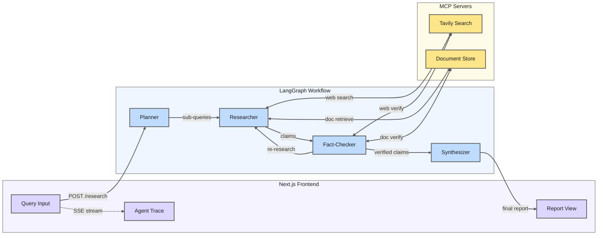

# MARSA - Multi-Agent ReSearch Assistant

[](https://github.com/farhan-ahmed1/marsa/actions/workflows/ci.yml)
[](https://codecov.io/gh/farhan-ahmed1/marsa)
[](https://www.python.org/downloads/)
[](https://opensource.org/licenses/MIT)
[](https://github.com/langchain-ai/langgraph)
[](https://www.anthropic.com/claude)

**Multi-Agent ReSearch Assistant** - A production-grade multi-agent system that orchestrates specialized AI agents via LangGraph with MCP-connected data sources to produce well-sourced, fact-checked research reports.

<!-- Demo GIF placeholder: record with OBS Studio, convert with gifski -->
<!--  -->

## What is MARSA?

Complex research questions often require synthesizing information from multiple sources, verifying claims against independent evidence, and presenting findings with proper citations. MARSA automates this workflow using a team of specialized AI agents - each focused on one aspect of research - orchestrated through LangGraph's state machine architecture. Unlike typical RAG chatbots, MARSA provides transparent agent activity tracking, source quality scoring, and human-in-the-loop checkpoints for critical research decisions.

## Architecture



**Data Flow:** Query &rarr; Planner &rarr; Researcher(s) &rarr; Fact-Checker &rarr; Synthesizer &rarr; Report

For detailed architecture diagrams including LangGraph workflow and MCP interactions, see [docs/architecture.md](docs/architecture.md).

## Features

- **Multi-Agent Orchestration**: Four specialized agents (Planner, Researcher, Fact-Checker, Synthesizer) collaborate through a LangGraph state machine
- **Parallel Research Execution**: Multi-faceted queries fan out to parallel researcher instances for faster results
- **Source Quality Scoring**: Weighted scoring based on domain authority (40%), recency (30%), and content depth (30%)
- **Fact-Check Loop**: Claims are verified against independent sources; failed verification triggers re-research
- **Human-in-the-Loop Checkpoints**: Pause after fact-checking for user feedback before final synthesis
- **Cross-Session Memory**: Prior research context is retrieved for related follow-up queries
- **Real-Time Observability**: SSE-streamed agent trace with timeline visualization in the UI
- **MCP-Based Data Access**: Clean separation between agents and data sources via Model Context Protocol

## Quick Start

```bash
# 1. Clone and install
git clone https://github.com/farhan-ahmed1/marsa.git
cd marsa
make setup

# 2. Configure environment
cp .env.example .env
# Edit .env with your API keys (see Environment Variables below)

# 3. Run the application
make dev  # Starts both backend and frontend

# 4. Open http://localhost:3000
```

For detailed setup instructions including Docker deployment, see [docs/setup.md](docs/setup.md).

## Evaluation Results

Evaluation run on 20 test queries across 5 categories (factual, comparison, exploratory, doc_context, false_premise):

| Metric | Target | Achieved |
| -------- | -------- | ---------- |
| Citation Accuracy | >= 85% | **100%** |
| Fact-Check Pass Rate | >= 70% | **85.3%** |
| False Premise Recall | >= 70% | **100%** |
| End-to-End Latency (p50) | < 30s | **10.7s** |
| End-to-End Latency (p95) | < 60s | **14.5s** |
| Average Quality Score | >= 3.5/5 | **3.68/5** |

<details>
<summary>Metrics by Category</summary>

| Category | Queries | Avg Quality | Avg Latency |
| ---------- | --------- | ------------- | ------------- |
| Factual | 5 | 4.11/5 | 11.6s |
| Comparison | 5 | 4.01/5 | 9.7s |
| Exploratory | 5 | 3.30/5 | 10.3s |
| Doc Context | 2 | 3.58/5 | 10.1s |
| False Premise | 3 | 3.13/5 | 10.3s |

</details>

Run the evaluation suite: `make eval`

## Tech Stack

| Layer | Technology | Purpose |
| ------- | ------------ | --------- |
| LLM | Claude API (Anthropic) | Agent reasoning and synthesis |
| Orchestration | LangGraph (Python) | State machine with conditional routing |
| MCP Servers | fastmcp | Standardized tool/data access |
| Vector DB | ChromaDB | Document storage and similarity search |
| Embeddings | OpenAI text-embedding-3-small | Document vectorization |
| Web Search | Tavily | Real-time web search API |
| Backend | FastAPI | Async API with SSE streaming |
| Frontend | Next.js + Tailwind + shadcn/ui | Real-time UI with agent trace |
| State Persistence | SQLite | LangGraph checkpointer |
| Observability | LangSmith | Tracing and debugging |

## Project Structure

```bash
marsa/
├── backend/
│   ├── agents/              # AI agents (planner, researcher, fact_checker, synthesizer)
│   ├── mcp_servers/         # MCP server implementations (tavily, document_store)
│   ├── graph/               # LangGraph workflow, state schema, checkpointer
│   ├── api/                 # FastAPI routes, SSE streaming
│   ├── memory/              # Cross-session memory layer
│   ├── eval/                # Evaluation framework and test queries
│   ├── utils/               # Rate limiting, resilience utilities
│   └── tests/               # Unit and integration tests
├── frontend/
│   └── src/
│       ├── app/             # Next.js pages
│       ├── components/      # React components (QueryInput, AgentTrace, ReportView)
│       └── hooks/           # Custom hooks (useAgentStream)
├── data/
│   ├── chromadb/            # Vector database storage
│   └── eval_results/        # Evaluation run outputs
├── docs/
│   ├── architecture.md      # System design diagrams
│   ├── design-decisions.md  # Technical rationale
│   └── setup.md             # Installation guide
└── docker-compose.yml       # Container orchestration
```

## Development Commands

| Command | Description |
| --------- | ------------- |
| `make setup` | Install all dependencies (Python + Node.js) |
| `make dev` | Run backend and frontend concurrently |
| `make test` | Run unit tests |
| `make test:integration` | Run integration tests (uses real APIs) |
| `make lint` | Lint code (ruff + eslint) |
| `make docker` | Run with Docker Compose |
| `make eval` | Run full evaluation suite |
| `make eval:quick` | Run quick evaluation (3 queries) |

## Environment Variables

| Variable | Required | Description |
| ---------- | ---------- | ------------- |
| `ANTHROPIC_API_KEY` | Yes | Claude API key for agent LLM calls |
| `OPENAI_API_KEY` | Yes | OpenAI API key for embeddings |
| `TAVILY_API_KEY` | Yes | Tavily API key for web search |
| `LANGCHAIN_TRACING_V2` | No | Set to `true` to enable LangSmith tracing |
| `LANGCHAIN_API_KEY` | No | LangSmith API key (if tracing enabled) |
| `LOG_LEVEL` | No | Logging level (default: `INFO`) |

## Future Work

- **Swap SQLite for Postgres** for production-scale state persistence and concurrent access
- **Add multi-model support** (Claude, GPT-4, Gemini) with automatic fallback for reliability
- **Implement streaming report generation** so users see the report build in real-time, paragraph by paragraph
- **Add a feedback loop** where human corrections during HITL checkpoints improve future responses via fine-tuning or prompt adaptation
- **Scale MCP servers independently** behind a service mesh for horizontal scaling under heavy query load
- **Add semantic caching** with embedding similarity to serve near-duplicate queries without re-running the full pipeline

## Documentation

- [Architecture](docs/architecture.md) - System diagrams, LangGraph workflow, data flow
- [Design Decisions](docs/design-decisions.md) - Rationale for technical choices
- [Setup Guide](docs/setup.md) - Detailed installation and troubleshooting
- [Changelog](CHANGELOG.md) - Version history and release notes
- [Resume Bullets](docs/resume-bullets.md) - Quantified project metrics for resumes

## License

This project is licensed under the MIT License - see the [LICENSE](LICENSE) file for details.
