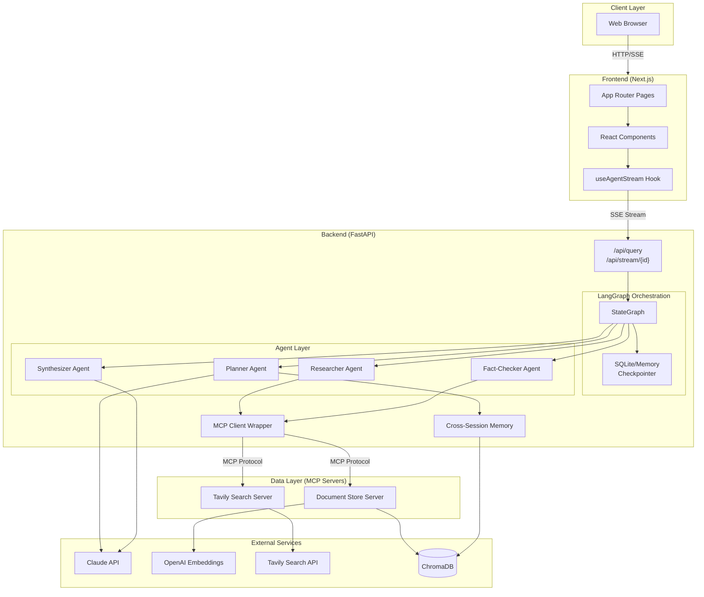
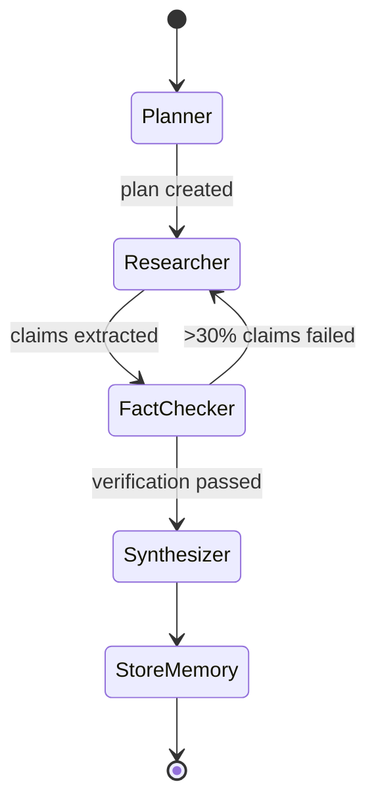
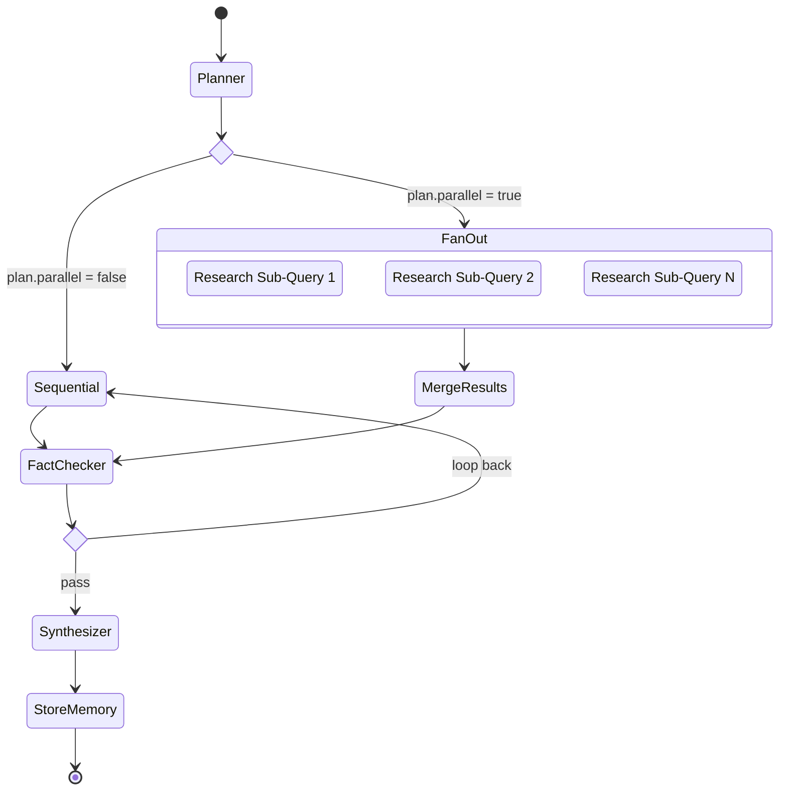
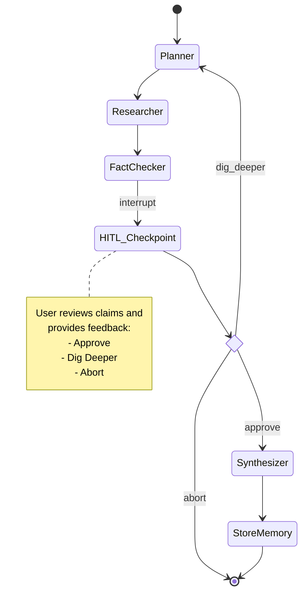
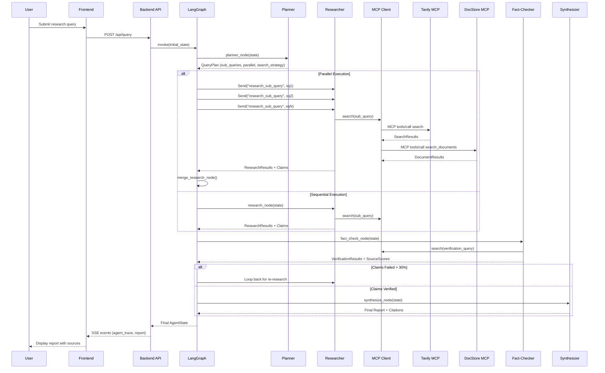
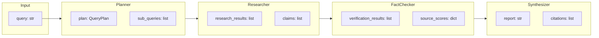
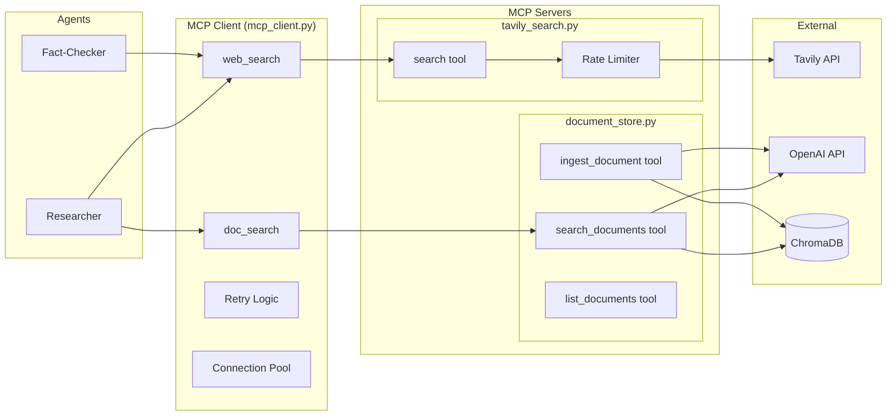
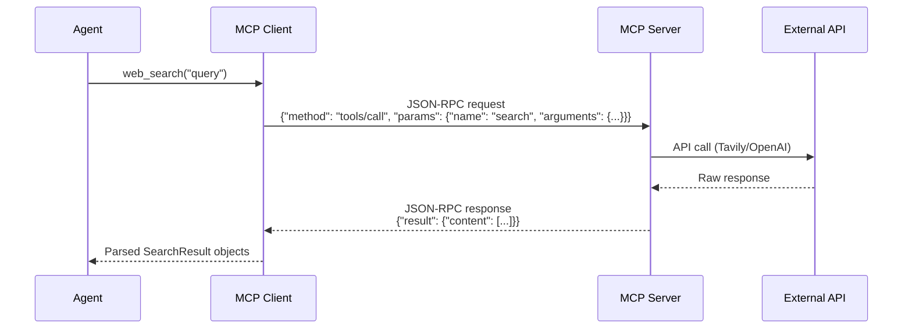
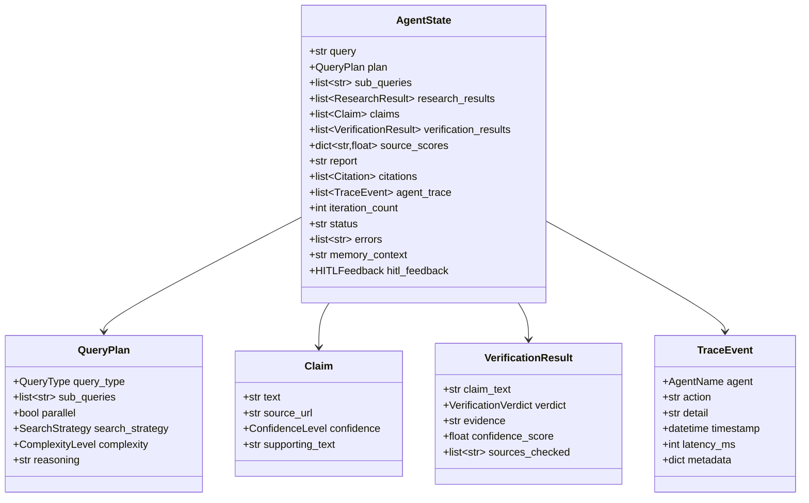
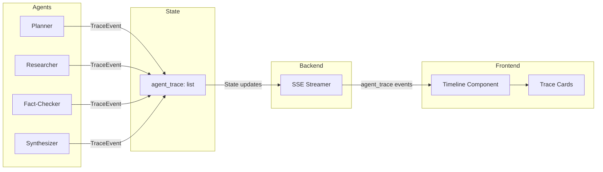

# Architecture

This document describes the system architecture of MARSA (Multi-Agent ReSearch Assistant), including the overall system design, LangGraph workflow, data flow, and MCP server interactions.

## Table of Contents

- [System Overview](#system-overview)
- [LangGraph Workflow](#langgraph-workflow)
- [Data Flow](#data-flow)
- [MCP Server Architecture](#mcp-server-architecture)
- [State Management](#state-management)
- [Observability](#observability)

---

## System Overview

MARSA is a three-tier application with a Next.js frontend, FastAPI backend, and MCP-connected data sources.



### Component Responsibilities

| Component | Responsibility |
| ----------- | ---------------- |
| **Next.js Frontend** | Query input, real-time agent trace display, report rendering |
| **FastAPI Backend** | HTTP API, SSE streaming, workflow orchestration |
| **LangGraph** | State machine execution, conditional routing, checkpointing |
| **Agents** | Specialized AI reasoning (planning, research, verification, synthesis) |
| **MCP Client** | Unified interface to MCP servers with retry logic |
| **MCP Servers** | Standardized data access via Model Context Protocol |
| **Cross-Session Memory** | Retrieval of prior research for related queries |

---

## LangGraph Workflow

The research pipeline is implemented as a LangGraph StateGraph with conditional routing and optional human-in-the-loop checkpoints.

### Sequential Mode

Default workflow for simple queries:



### Parallel Mode

For multi-faceted queries (e.g., comparisons), sub-queries fan out to parallel workers:



### Human-in-the-Loop Mode

When `enable_hitl=True`, the workflow pauses after fact-checking for user feedback:



### Workflow Graph Definition

The workflow is defined in [backend/graph/workflow.py](../backend/graph/workflow.py):

```python
# Core nodes
workflow.add_node("planner", planner_with_trace)
workflow.add_node("research_sequential", researcher_with_status)
workflow.add_node("research_sub_query", research_sub_query_node)  # Parallel worker
workflow.add_node("merge_research", merge_research_with_status)
workflow.add_node("fact_checker", fact_checker_with_status)
workflow.add_node("synthesizer", synthesizer_with_status)
workflow.add_node("store_memory", store_memory_node)

# Conditional routing for parallel execution
workflow.add_conditional_edges(
    "planner",
    route_sub_queries,  # Returns Send objects for parallel fan-out
    {"research_sequential": "research_sequential"}
)

# Fact-check loop-back condition
workflow.add_conditional_edges(
    "fact_checker",
    route_after_fact_check,
    {"researcher": "research_sequential", "synthesizer": "synthesizer"}
)
```

---

## Data Flow

### Query Processing Flow



### State Transformation

Each agent transforms specific fields in the `AgentState`:



---

## MCP Server Architecture

MARSA uses the Model Context Protocol (MCP) to standardize data access. Agents interact with MCP servers through a unified client wrapper.

### MCP Integration



### MCP Server Tools

#### Tavily Search Server

| Tool | Parameters | Returns |
| ---------- | ------------ | --------- |
| `search` | `query: str`, `max_results: int = 5` | `list[SearchResult]` with title, url, content, score |

#### Document Store Server

| Tool | Parameters | Returns |
| ------ | ------------ | --------- |
| `search_documents` | `query: str`, `n_results: int = 5` | `list[DocumentResult]` with content, source, relevance_score |
| `ingest_document` | `title: str`, `content: str`, `source_url: str` | `IngestResult` with document_id, chunk_count |
| `list_documents` | - | `list[DocumentSummary]` with title, source, chunk_count |

### MCP Protocol Flow



---

## State Management

### AgentState Schema

The `AgentState` TypedDict flows through the LangGraph workflow:



### Checkpointing

LangGraph checkpointing enables:

1. **State inspection**: View what each agent produced
2. **Workflow resumption**: Resume interrupted workflows (critical for HITL)
3. **Debugging**: Replay workflows from any checkpoint

```python
# Memory checkpointer (development)
checkpointer = InMemorySaver()

# SQLite checkpointer (production)
checkpointer = SqliteSaver(db_path="checkpoints.db")

# Compile with checkpointer
app = workflow.compile(checkpointer=checkpointer)
```

---

## Observability

### Trace Event Pipeline

Every agent action generates a `TraceEvent` that flows to the frontend via SSE:



### Event Types

| Event Type | Description | Example |
| ------------ | ------------- | --------- |
| `agent_started` | Agent begins processing | Planner begins query decomposition |
| `tool_called` | MCP tool invocation | Researcher calls web_search |
| `tool_result` | MCP tool response received | 5 search results returned |
| `claim_extracted` | Claim extracted from research | Claim about Python GIL |
| `claim_verified` | Fact-check verdict | Claim supported with evidence |
| `report_generating` | Synthesis in progress | Generating final report |
| `complete` | Workflow finished | Report ready with 8 citations |
| `error` | Error occurred | Rate limit exceeded |

### LangSmith Integration

For production observability, enable LangSmith tracing:

```bash
export LANGCHAIN_TRACING_V2=true
export LANGCHAIN_API_KEY=your-key
```

LangSmith captures:

- Full LLM prompt/response pairs
- Token usage and costs
- Latency breakdown by component
- Error traces and retries

---

## Related Documentation

- [Design Decisions](design-decisions.md) - Rationale for architectural choices
- [Setup Guide](setup.md) - Installation and configuration
- [API Reference](../backend/api/routes.py) - Endpoint documentation
